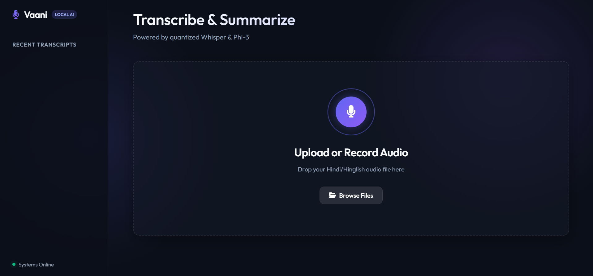

# Vaani | On-Device Hindi-Hinglish Voice Intelligence

 *(UI Screenshot placeholder)*

## Problem Statement

Indian businesses (support teams, sales, small business owners) communicate heavily via Hindi-English code-switched voice notes. Existing transcription options are either manual (slow) or cloud APIs like OpenAI/Google Speech-to-Text (expensive per-minute, and mediocre at code-switched Hindi-English specifically). 

**Vaani** solves this by self-hosting highly quantized ASR (Whisper) and LLM (Phi-3) models so that transcription and summarization run cheaply on **CPU-only infrastructure**. No audio or data is ever sent to a third-party AI API — making it completely privacy-preserving and cheap enough to price competitively.

## Architecture

Vaani achieves its extreme efficiency through two core pipelines:

1. **ASR (Speech-to-Text):** Uses a custom INT8 quantized `Whisper-small` model running via `optimum.onnxruntime`. Audio is force-chunked and resampled using FFmpeg to guarantee no hallucinations on long clips, delivering lightning-fast CPU inference.
2. **LLM (Summarization & Extraction):** Uses Microsoft's `Phi-3-mini` (3.8B parameters) quantized to 4-bit (`Q4_K_M`) GGUF. By bypassing slow Python bindings and acting as a reverse-proxy to the native C++ `llama-server.exe`, it achieves upwards of 7-10 tokens/s on a standard CPU.

## Tech Stack

* **Backend:** FastAPI, SQLAlchemy (SQLite), python-multipart, slowapi (Rate Limiting)
* **ML Inference:** `llama.cpp` (LLM), `optimum` & `onnxruntime` (ASR)
* **Frontend:** Vanilla HTML/JS, Modern CSS (Glassmorphism), Web Audio API (Reactive visualizations)
* **Audio Processing:** `ffmpeg` & `librosa`

## Setup & Installation

### Prerequisites
* Python 3.10+
* `ffmpeg` installed and added to your system PATH
* A CPU (No GPU required, though CUDA is supported)

### 1. Clone & Environment Setup
```bash
git clone https://github.com/your-username/Vaani_hindi_hinglish.git
cd Vaani_hindi_hinglish
python -m venv venv

# Windows
.\venv\Scripts\Activate.ps1
# Mac/Linux
source venv/bin/activate
```

### 2. Install Dependencies
```bash
pip install -r backend/requirements.txt
```

### 3. Model Setup (Optional if downloaded)
To fetch and quantize the models yourself:
```bash
pip install -r ml/requirements.txt
python ml/export/quantize_only.py
```
*(Ensure `llama.cpp` binaries are in your PATH).*

### 4. Run the Server
```bash
uvicorn backend.main:app --host 127.0.0.1 --port 8000
```
Open `http://127.0.0.1:8000` in your browser!

## Project Structure

```
Vaani/
├── backend/          # FastAPI App, SQLite Database, and ML proxy services
├── ml/               # Model quantization, ONNX export, and benchmarking scripts
├── models/           # Downloaded INT8 ONNX and INT4 GGUF weights
├── web/              # Vanilla JS/CSS Frontend
└── .env              # Environment configurations
```

## Upcoming Features
* **Telegram Bot Integration:** Forward voice notes directly to Vaani for instant summarization.
* **Dockerization:** Complete containerization for 1-click deployments to Hugging Face Spaces.
