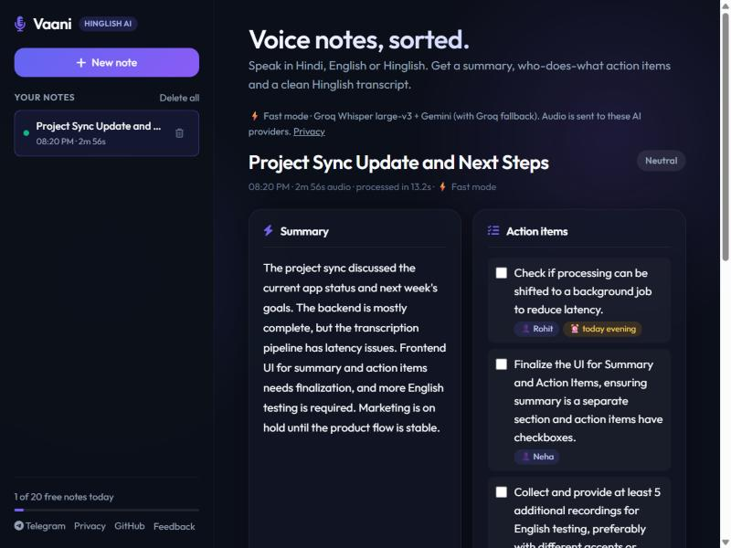
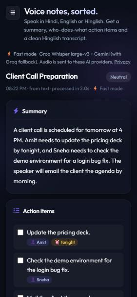
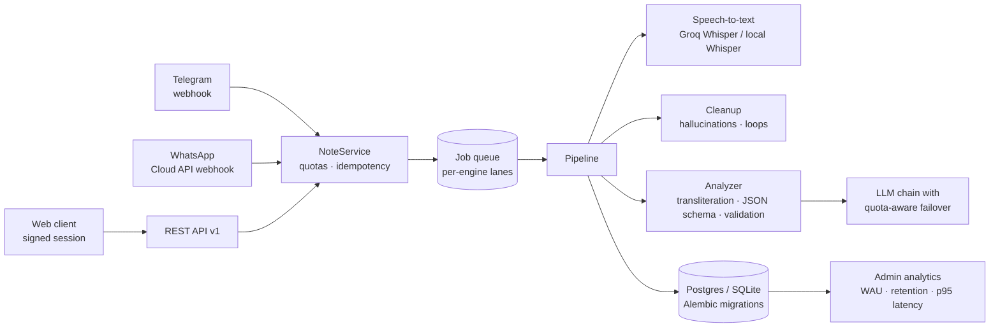

# Vaani: Hinglish voice notes → summaries & action items

Send a voice note in **Hindi, English or Hinglish** (the code-mixed way most of urban India talks) and get back
a short summary, **who-does-what-by-when action items**, and a clean transcript in Romanized Hinglish.
Works on **Telegram**, **WhatsApp** and the **web**.

[](https://github.com/SID-singh1/Vaani/actions/workflows/ci.yml)
· Try it: [@Vaani_hinglish_bot](https://t.me/Vaani_hinglish_bot) on Telegram

<p align="center">
  
  
</p>

> *"Kal client ke saath call hai 4 baje. Amit tu pricing deck update kar dena by tonight…"*
> → **Update the pricing deck** · 👤 Amit · ⏰ tonight

## Results

Measured with the [evaluation suite](evaluation/README.md) (LLM judge from a different model family; full report:
[benchmark_report.md](evaluation/benchmark_report.md)):

| Fast mode (Groq Whisper large-v3 + Gemini 2.5 Flash) | Real recording (2.9 min) | 14 synthetic clips |
|---|--:|--:|
| Word error rate, strict / Hinglish-normalized | 10.2% / 6.2% | 7.1% / 3.8% |
| Expected action items found (recall) | 100% | 81% |
| Generated action items supported by the transcript (precision) | 88% | 100% |
| Processing time | 13.2 s (0.07× real time) | ~3 s per clip |

**Caveats, stated up front:** there is only one real recording so far; the synthetic clips are text-to-speech and
therefore optimistic. Nearly every "unsupported claim" the judge found traced back to speech recognition mishearing
names and jargon ("Groq" → "Grok"), not to the language model inventing things. More real recordings are the next
step ([how to contribute one](evaluation/README.md#adding-a-real-recording)).

## Why two engines

Vaani started fully on-device: INT8-quantized Whisper and a 4-bit Phi-3 running on a laptop CPU. That works,
but no free host can run ~3 GB of models (Render's free tier has 512 MB of RAM), and CPU inference is slow.
So the project ships two engines behind one interface:

| | ⚡ **Fast** (hosted default) | 🔒 **Private** (self-hosted) |
|---|---|---|
| Speech-to-text | Whisper large-v3 on Groq | Whisper (faster-whisper INT8, or the original ONNX INT8 export) on your CPU |
| Summary & actions | Gemini 2.5 Flash → Gemini 3.5 Flash → Groq gpt-oss-120b → Gemini 3.5 Flash-Lite (automatic failover) | A local GGUF model via llama.cpp server |
| Where audio goes | Groq and Google (see [privacy](web/privacy.html)) | Nowhere: it never leaves the machine |
| Runs on | Free tiers, ₹0 | Any machine with ~6 GB RAM (`docker compose up`) |

Where both are available, users choose per account (`/mode` in Telegram, a toggle on the web).

## Architecture


```mermaid
flowchart LR
    TG[Telegram<br/>webhook] --> SVC
    WA[WhatsApp<br/>Cloud API webhook] --> SVC
    WEB[Web client<br/>signed session] --> API[REST API v1] --> SVC
    SVC[NoteService<br/>quotas · idempotency] --> Q[(Job queue<br/>per-engine lanes)]
    Q --> P[Pipeline]
    P --> ASR[Speech-to-text<br/>Groq Whisper / local Whisper]
    P --> CLEAN[Cleanup<br/>hallucinations · loops]
    P --> AN[Analyzer<br/>transliteration · JSON schema · validation]
    AN --> LLMS[LLM chain with<br/>quota-aware failover]
    P --> DB[(Postgres / SQLite<br/>Alembic migrations)]
    DB --> ADMIN[Admin analytics<br/>WAU · retention · p95 latency]
```

Design choices worth knowing:

- **One process, by design.** API, job queue and both bots run in a single container because that is what a free
  instance can run. Jobs persist their status in the database and are marked failed (with a clear message) if the
  process restarts mid-note. Scaling out would mean moving the queue to Postgres (`SKIP LOCKED`) or Redis; the
  `JobManager` interface wouldn't change.
- **Free-tier engineering.** Each model has its own small free quota, so the LLM chain treats them as one pool:
  quota errors are never retried (retries also count), exhausted models are skipped without a request until they
  recover, and short per-minute limits are waited out instead of failing the note. Per-user and global daily limits
  keep the service inside the free tiers.
- **Hinglish handling.** Whisper often writes Hindi in Devanagari (or Urdu script). Short notes are transliterated
  and analyzed in one LLM call to save quota; long ones are transliterated in chunks so no single response gets
  truncated. A rule-based transliterator with Hindi schwa deletion (करना → *karna*, not *karanaa*) does the
  private engine's transliteration and backs up the LLM, so users never get Devanagari back.
- **Untrusted model output.** Transcripts are passed to the LLM as data; output must match a JSON schema and pass
  validation, otherwise the next model in the chain answers.
- **Webhooks, not polling.** Free instances sleep; Telegram's and Meta's webhook requests wake them.
- **Privacy.** Audio is deleted after transcription; transcripts are never logged by default; WhatsApp numbers are
  stored only as keyed hashes; users can delete their data from every channel.

## Tech stack

FastAPI · SQLAlchemy + Alembic · httpx · python-telegram-bot · WhatsApp Cloud API · Groq · Gemini ·
faster-whisper / ONNX Runtime · llama.cpp · vanilla JS · Docker · GitHub Actions · pytest (134 tests, offline
fakes for every provider, a fake Telegram Bot API and a mocked WhatsApp Graph API).

## Run it locally

```bash
python -m venv venv && venv\Scripts\activate       # Windows (macOS/Linux: source venv/bin/activate)
pip install -r requirements-dev.txt
cp .env.example .env                               # add GROQ_API_KEY and GEMINI_API_KEY
python scripts/dev.py                              # http://127.0.0.1:8000
```

`scripts/dev.py` always uses a local SQLite file and keeps Telegram off, even if `.env` points at production.
Add `--private` to enable the on-device engine, or `--telegram-polling` (with a separate *test* bot token).

```bash
pytest                                # 134 tests, ~5 s, no network
python scripts/run_eval_suite.py      # evaluation (uses your API keys)
```

Deploying (Render + Supabase, all free), WhatsApp setup and self-hosting: **[DEPLOY.md](DEPLOY.md)**.

## Project layout

```
backend/vaani/        the application package
  engines/            provider adapters (Groq, Gemini, OpenAI-compatible, local Whisper, llama.cpp)
  analysis.py         prompts, schemas, validation, transliteration strategy
  pipeline.py         one note end to end;  jobs.py: background queue
  channels/           Telegram and WhatsApp
  api/                REST API, admin analytics
  text/               transcript cleanup, rule-based transliteration
  migrations/         Alembic
web/                  web client, admin dashboard, privacy page
evaluation/           metrics, LLM judge, manifest, results
ml/                   original quantization/export and benchmark scripts (ONNX INT8 Whisper, GGUF Phi-3)
marketing/            landing page (React + Vite, GitHub Pages)
```

## Limitations

- One real recording in the evaluation set (more wanted).
- Speech recognition still mishears names and technical terms.
- Free-tier quotas cap throughput; see [DEPLOY.md](DEPLOY.md#6-free-tier-limits-and-capacity).
- The private engine hasn't been re-benchmarked since v2; its numbers will be added to the report.
